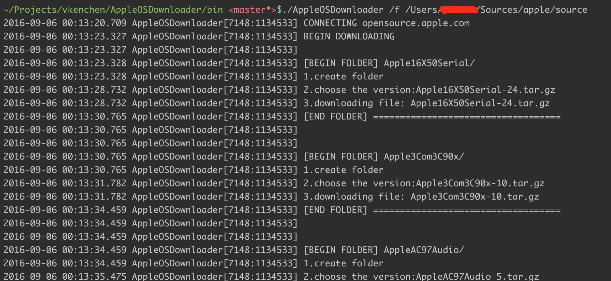

# 苹果源码下载
该程序从[http://opensource.apple.com/source/](http://opensource.apple.com/source/)抓取源码，有repo版本的自动下载最后一个版本。
## 效果

## 使用方法

AppleOSDownloader [/f][destion_folder]

<li>当前路径下载</li>
<pre>
./AppleOSDownloader
</pre>

<li>指定路径下载</li>
<pre>
./AppleOSDownloader /f /Users/vkenchen/Sources/apple/source
</pre>
## 原理
后续补充
## 源码说明
后续补充